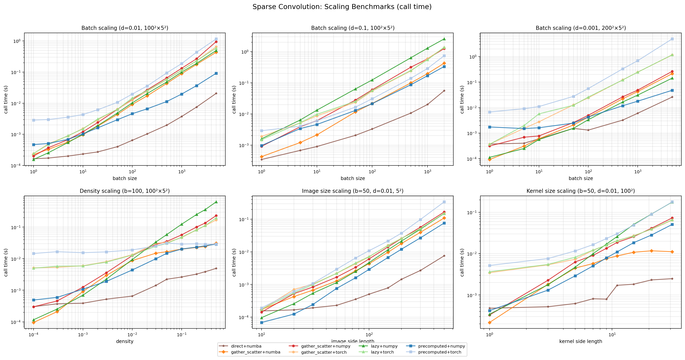
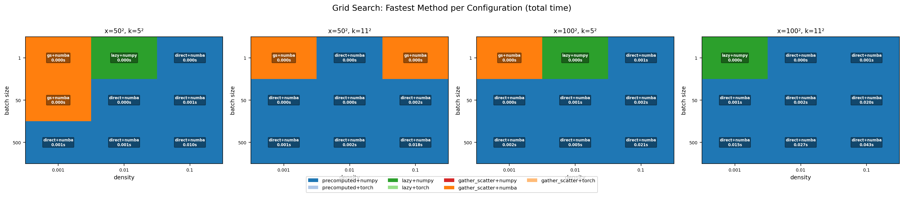
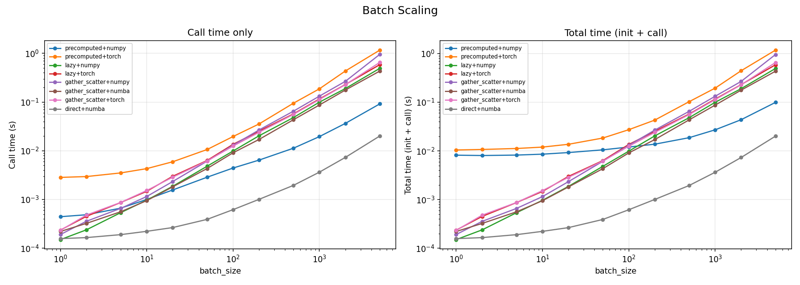
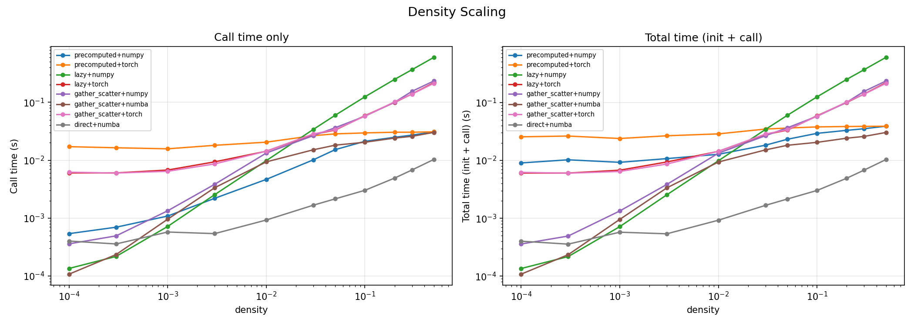
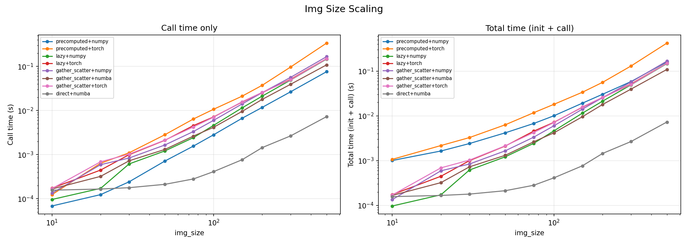
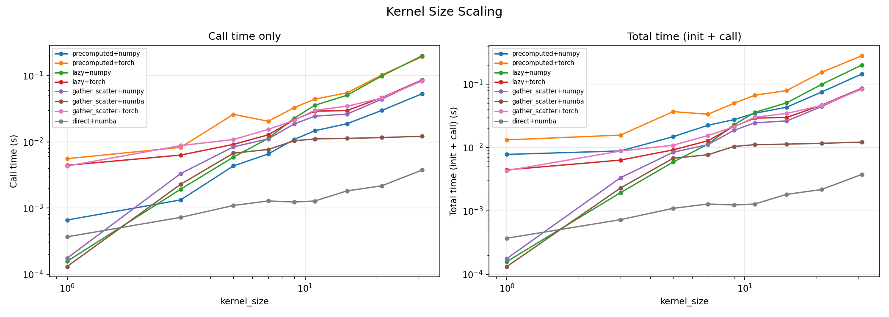
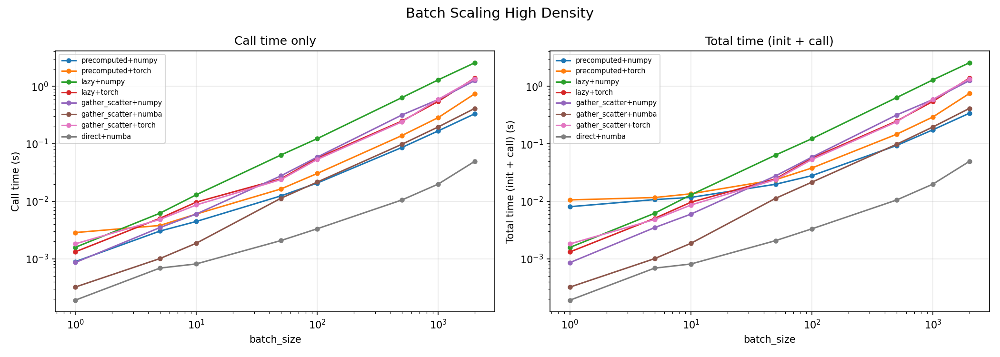
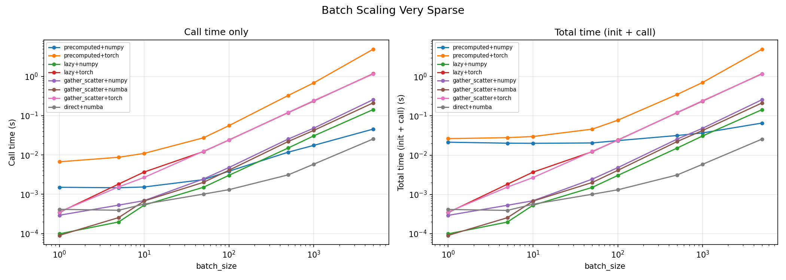

# sparse_convolution
Sparse 2D convolution in Python via Toeplitz matrix methods.

Fast when the kernel is small, the input is sparse, and/or many arrays share the same kernel.

## Install
```
pip install sparse_convolution
```

Or from source:
```
git clone https://github.com/RichieHakim/sparse_convolution
cd sparse_convolution
pip install -e .
```

## Usage

### Single image
```python
import numpy as np
import scipy.sparse
import sparse_convolution as sc

x = scipy.sparse.random(100, 100, density=0.01)
k = np.random.rand(5, 5)

conv = sc.Toeplitz_convolution2d(x_shape=x.shape, k=k, mode='same')
out = conv(x=x, batching=False).toarray()
```

### Batched
Input: `(n_images, H * W)` sparse matrix. Output: `(n_images, H_out * W_out)`.
```python
x_batch = scipy.sparse.vstack([
    scipy.sparse.random(100, 100, density=0.01).reshape(1, -1)
    for _ in range(50)
]).tocsr()

conv = sc.Toeplitz_convolution2d(x_shape=(100, 100), k=k, mode='same')
out = conv(x=x_batch, batching=True)
```

## Methods and backends

Four methods, each with selectable backends:

| Method | numpy | numba | torch |
|---|:---:|:---:|:---:|
| `direct` | n/a | yes | n/a |
| `precomputed` | yes | yes | yes |
| `lazy` | yes | n/a | yes |
| `gather_scatter` | yes | yes | yes |

- **`direct`**: Batch-parallel scatter convolution with thread-local dense buffers (numba only). For each image in parallel, scatters kernel-weighted input values into an L2-cache-sized accumulator buffer, then extracts nonzeros into CSR format. Uses a two-phase approach: a lightweight boolean counting pass (1-byte flags, no float arithmetic) determines exact output sizes, then the scatter pass writes directly to right-sized arrays with zero waste. Interior pixels (~92-100%) skip bounds checking entirely via precomputed safe regions. O(nnz × K) per image with no init overhead. Fastest method across nearly all configurations. Requires `numba`.
- **`precomputed`**: Builds a sparse Toeplitz matrix at init; fast batched matmul. Best for large batches with the same kernel when numba is not available.
- **`lazy`**: COO broadcasting, no init cost. Best for very sparse inputs with small batches.
- **`gather_scatter`**: Per-kernel-position scatter into a dense accumulator. General-purpose method for sparse batched inputs. Uses `numba` automatically when available, and falls back to `numpy` otherwise.

Backend selection:
- **`numpy`**: scipy/numpy ops. Always available.
- **`numba`**: JIT-compiled parallel loops. Fastest on CPU for batched inputs. Requires `numba`.
- **`torch`**: PyTorch ops with optional GPU. Requires `torch`.

```python
conv = sc.Toeplitz_convolution2d(
    x_shape=(100, 100),
    k=k,
    mode='same',
    method='direct',  # default
    backend=None,     # numba for the default direct method
)
```

If `backend=None` (default), `direct` uses `numba`. For environments without numba, choose a numpy-capable method explicitly, such as `method='gather_scatter', backend='numpy'` or `method='precomputed', backend='numpy'`.

## Matrix size guidance

The current implementations are intended for moderately sized 2D inputs. In practice, matrices below roughly `1000 x 1000` are the safest target. Larger inputs can require very large sparse index structures or dense accumulator buffers depending on the selected method, kernel size, sparsity, batch size, and backend.

For larger inputs:

- prefer `method='direct'` with the default numba backend when numba is available;
- tune `max_buffer_bytes` when using `method='gather_scatter'`;
- avoid `method='precomputed'` unless the Toeplitz matrix size is known to fit comfortably in memory;
- test representative data before relying on the output in production workflows.

## References
- Toeplitz convolution: [stackoverflow.com/a/51865516](https://stackoverflow.com/a/51865516), [alisaaalehi/convolution_as_multiplication](https://github.com/alisaaalehi/convolution_as_multiplication)
- 1D convolution matrix: [scipy.linalg.convolution_matrix](https://docs.scipy.org/doc/scipy/reference/generated/scipy.linalg.convolution_matrix.html)

## Benchmarks

All benchmarks run on CPU with 1s minimum measurement time per configuration (median reported). Nine method+backend combinations compared across six scaling sweeps.

### Scaling overview

Six scaling sweeps varying batch size, density, image size, and kernel size. `direct+numba` (brown stars) is the fastest method in nearly all regimes.



### Grid search: fastest method per configuration

Each cell shows the winning method and total time (init + call) for that batch size × density combination. `direct+numba` wins 28 of 36 configurations with an average 4.75× speedup over the second-fastest method.



### Individual scaling curves

<details>
<summary>Batch size scaling — 100×100, 5×5, density=0.01</summary>


</details>

<details>
<summary>Density scaling — 100×100, 5×5, batch=100</summary>


</details>

<details>
<summary>Image size scaling — 5×5, density=0.01, batch=50</summary>


</details>

<details>
<summary>Kernel size scaling — 100×100, density=0.01, batch=50</summary>


</details>

<details>
<summary>Batch scaling — high density (0.1)</summary>


</details>

<details>
<summary>Batch scaling — very sparse (density=0.001, 200×200)</summary>


</details>
